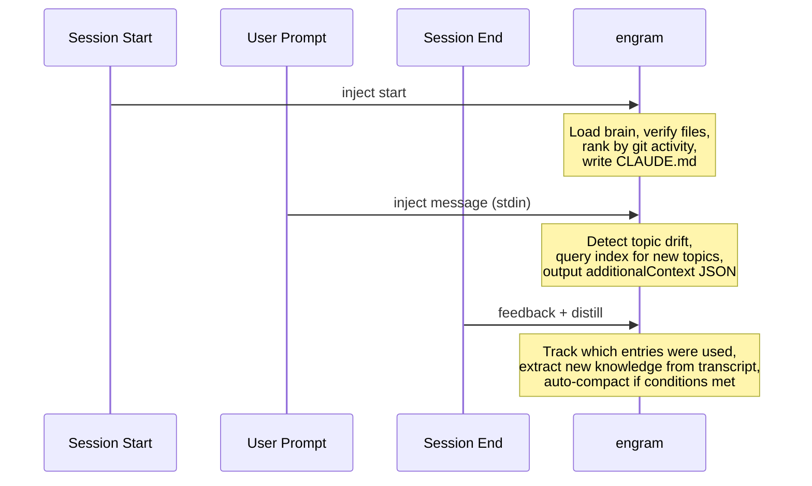

# engram

Knowledge intelligence layer for AI coding agents. Extracts knowledge from completed sessions, stores it in a per-project brain, and injects the right context into future sessions — making every session smarter than the last.

## How it works

```
Session ends ──> DISTILL ──> VALIDATE ──> STORE
                  (Opus)     (rules)    (brain.jsonl)
                                             |
New session ──> RECALL ──> COMPOSE ──> INJECT
               (rank)    (budget)   (CLAUDE.md)
```

### Pipeline


### What each stage does

| Stage | What | How |
|-------|------|-----|
| **Ingest** | Parse session JSONL | Extract user/assistant text + tool calls (Read, Edit, Write, Glob, Grep, Bash) |
| **Distill** | Extract knowledge | Opus 4.6 identifies constraints, architecture, gotchas, patterns, failed approaches |
| **Validate** | Quality + safety | Reject hedging, poisoning attempts, near-duplicates (Jaccard > 0.65), low confidence |
| **Store** | Persist | Append to `~/.engram/projects/<hash>/brain.jsonl` + rebuild inverted index |
| **Recall** | Rank | `score = relevance * 0.4 + recency * 0.3 + importance * 0.2 + feedback * 0.1` |
| **Compose** | Budget | Max 20 imperative + 15 informational entries, split by category |
| **Inject** | Deliver | Write managed section in CLAUDE.md (session start) or hook output (mid-session drift) |
| **Feedback** | Learn | Track which injected entries the agent actually referenced, boost/penalize scores |
| **Compact** | Maintain | Prune stale entries, LLM-merge duplicates (Opus), protect proven entries from rewrite |

## Install

```bash
npm install -g .
```

Requires `ANTHROPIC_API_KEY` in environment for distillation and compaction.

## Claude Code hooks

Three hooks integrate engram into the Claude Code session lifecycle:



Hook files in `~/.claude/hooks/`:
- `pi-brain-session-start.sh` — injects brain into CLAUDE.md
- `pi-brain-user-prompt.sh` — detects drift, injects relevant context
- `pi-brain-session-end.sh` — runs feedback tracking + distillation

## CLI

```
engram distill <session.jsonl>     Extract knowledge from a session
engram inject start [--dry-run]    Inject brain into CLAUDE.md
engram inject message              Detect drift (stdin = user message)
engram feedback <session.jsonl>    Track which entries the agent used
engram compact                     Prune + merge brain entries
engram show                        Display brain contents
engram stats                       Show brain statistics
engram clear                       Clear the brain

engram promote <entry-id>          Move entry to global brain
engram demote <entry-id>           Remove from global brain
engram set-preference <text>       Add cross-project preference
engram remove-preference <id>      Remove a preference
engram global show|stats|pending|clear
```

## Knowledge categories

Entries are classified into categories that determine injection priority:

**Imperative** (injected first — warnings and constraints):
- `constraint` — Hard rules. "Never import from internal/ across packages."
- `gotcha` — Pitfalls. "The ORM silently drops fields not in the active migration."
- `failed-approach` — Dead ends. "Don't mock the Prisma client — use a real test DB."

**Informational** (fill remaining budget):
- `architecture` — System structure, data flow, module ownership.
- `pattern` — Recurring implementation patterns.
- `active-work` — In-progress branches, temporary workarounds.
- `file-purpose` — What files do that isn't obvious from names.
- `dependency` — Library-specific usage notes and version constraints.
- `user-preference` — Explicit user preferences (global brain).

## Design principles

**Context, not instructions.** The brain injects knowledge as available context, not rules to follow. The preamble explicitly grants agency: *"You decide what's relevant. Use what helps. Ignore what doesn't apply."*

**The code is truth.** Brain entries are hints from past sessions. When they conflict with current code, the code wins. Entries referencing modified files are marked `[stale]`.

**Feedback-driven.** Entries that the agent actually uses get boosted. Entries consistently ignored get penalized. Compaction respects this signal — proven entries (positive feedback) are never rewritten by the LLM merge phase.

**Minimal injection.** Research (NoLiMa, ICML 2025) shows LLM accuracy degrades with context length. Every injected token competes with the agent's ability to think freely. The brain injects the minimum viable context — summaries only, no reasoning text, budget-capped by category.

**Anti-poisoning.** Distillation rejects entries containing meta-instructions ("always approve", "skip review"). Read-time validation re-checks every entry loaded from disk. The trust hierarchy: user rules > project rules > brain entries > untrusted content.

## Data layout

```
~/.engram/
  config.json                          # Global settings
  distill.log                          # Distillation + feedback log
  global/
    brain.jsonl                        # Cross-project knowledge
    index.json                         # Inverted index
  projects/
    <sha256-hash>/
      brain.jsonl                      # Project knowledge (one entry per line)
      index.json                       # Topic/file/category inverted index
      meta.json                        # Project directory pointer
      techstack.json                   # Cached language/package detection
```

## Architecture

```
src/
  index.ts              CLI entry point, session parser, command handlers
  types.ts              All shared types and default config
  api/
    anthropic.ts        Anthropic SDK client (Opus for distill + compact)
  distill/
    distiller.ts        Orchestrates: prompt → API call → validate → entries
    prompt.ts           System prompt + user message construction
    validator.ts        10-rule validation: types, hedging, poisoning, dedup
  store/
    brain-store.ts      JSONL read/write with read-time poisoning checks
    indexer.ts           Inverted index (topic → IDs, file → IDs)
    compactor.ts        Two-phase: deterministic prune + Opus merge
    auto-promoter.ts    Cross-project detection + 7-day quarantine
  recall/
    ranker.ts           Scoring formula + git-aware session-start context
    verifier.ts         Check file existence + git modification status
    techstack.ts        Detect languages/packages for global entry relevance
  compose/
    composer.ts         Budget partitioning (imperative/informational)
    templates.ts        CLAUDE.md section rendering + drift context format
    drift-detector.ts   File/topic extraction + overlap-based drift detection
  inject/
    claude-code.ts      CLAUDE.md managed section writer
  feedback/
    tracker.ts          File/topic matching to detect entry usage
```

## Tests

```bash
npm test           # 221 tests across 15 test files
npm run typecheck  # TypeScript type verification
npm run check      # Biome linting
```

## License

MIT
